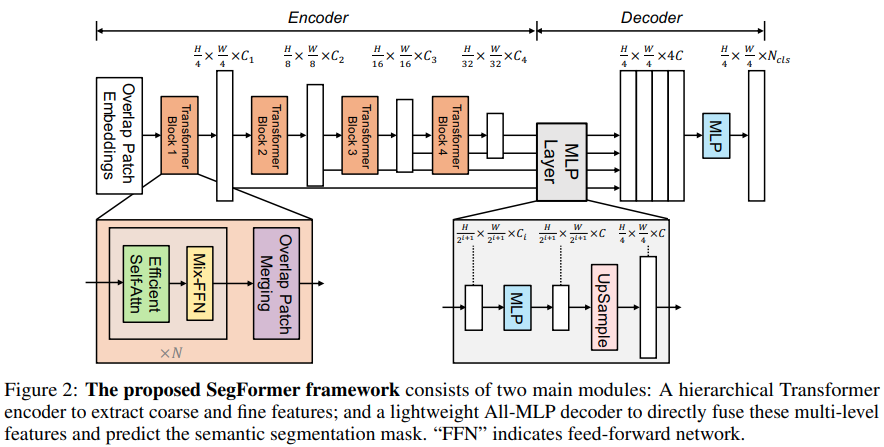

</img>

## Segformer - Pytorch

Implementation of <a href="https://arxiv.org/abs/2105.15203">Segformer</a>, Attention + MLP neural network for segmentation, in Pytorch.

## Install

```bash
$ pip install segformer-pytorch
```

## Usage

For example, MiT-B0

```python
import torch
from segformer_pytorch import Segformer

model = Segformer(
    patch_size = 4,                 # patch size
    dims = (32, 64, 160, 256),      # dimensions of each stage
    heads = (1, 2, 5, 8),           # heads of each stage
    ff_expansion = (8, 8, 4, 4),    # feedforward expansion factor of each stage
    reduction_ratio = (8, 4, 2, 1), # reduction ratio of each stage for efficient attention
    num_layers = 2,                 # num layers of each stage
    decoder_dim = 256,              # decoder dimension
    num_classes = 4                 # number of segmentation classes
)

x = torch.randn(1, 3, 256, 256)
pred = model(x) # (1, 4, 64, 64)  # output is (H/4, W/4) map of the number of segmentation classes
```

Make sure the keywords are at most a tuple of 4, as this repository is hard-coded to give the MiT 4 stages as done in the paper.

## Citations

```bibtex
@misc{xie2021segformer,
    title   = {SegFormer: Simple and Efficient Design for Semantic Segmentation with Transformers}, 
    author  = {Enze Xie and Wenhai Wang and Zhiding Yu and Anima Anandkumar and Jose M. Alvarez and Ping Luo},
    year    = {2021},
    eprint  = {2105.15203},
    archivePrefix = {arXiv},
    primaryClass = {cs.CV}
}
```
